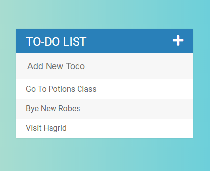
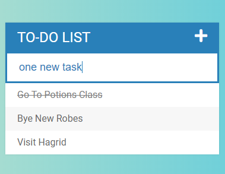
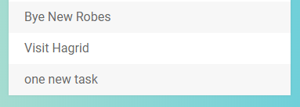
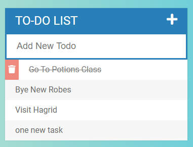
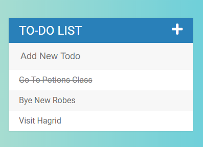

# TodoListProject
A fun project to create a responsive Todo List. You can add new tasks, strike them off or even delete them. 

## Add a New Task:
 
1. You can add a task by describing it the input box and pressing 
  **Enter Key**.
## Delete a Task

1. You can delete a task by clicking on the
  **Bin**.
## Strike a Task Off

1. You can delete a task by clicking on the
  **Task**.
#### Plus Button
1. Click the **PLUS Button** once to toggle the input box.
